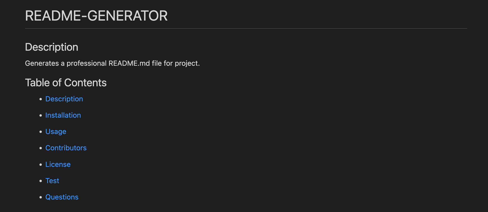

# README-Generator

  ## Description

  A step-by-step user input through node to generate a well organized, professional, and detailed README file for project.

  ## Table of Contents
  - [Description](#description)
  - [Installation](#installation)
  - [Usage](#usage)
  - [Contributors](#contributors)
  - [License](#license)
  - [Test](#tests)
  - [Questions](#questions)
  - [Repository](#repository)
  - [Screenshot](#screenshot)

  ## Installation
   To run this application you will neeed to install the following: 

  Install all necessary JSON packages.  Use 'npm i' to install Inquirer.

  ## Usage

  Open Terminal after copying and cloning repository.  Type node index.js in terminal and you will then be prompted with a series of questions.  Fill in answers and once completed a README file will be generated for preview.

  ## Contributors

  Latoya Lyew

  ## License
  

  ## Tests

  Test file will be added in the future.

  ## Questions

  If you should have any questions about project, please visit github at [https:/github.com/lflyew](https://github.com/lflyew/) or email me at lflyew@gmail.com

  ## Screenshot

  

  